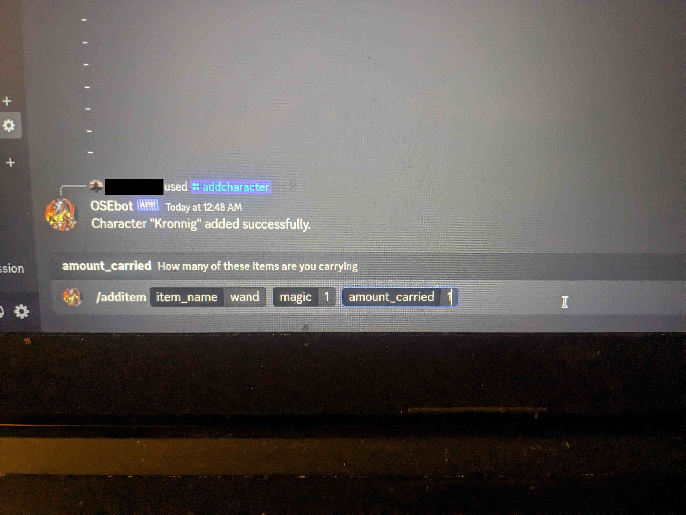
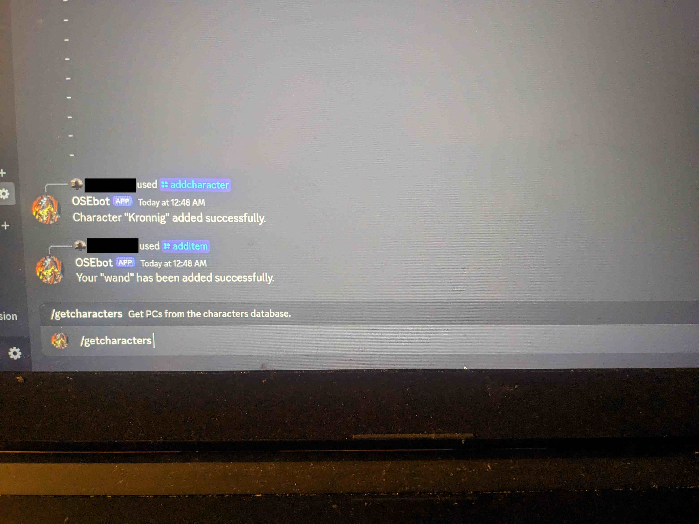
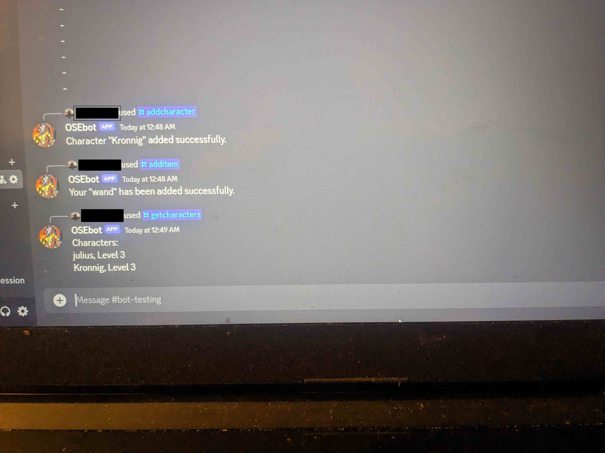
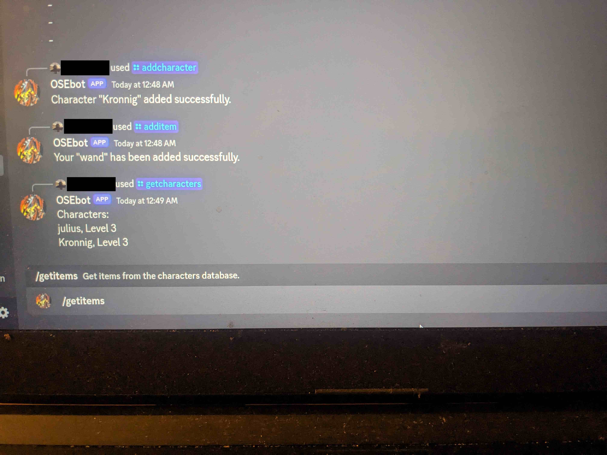
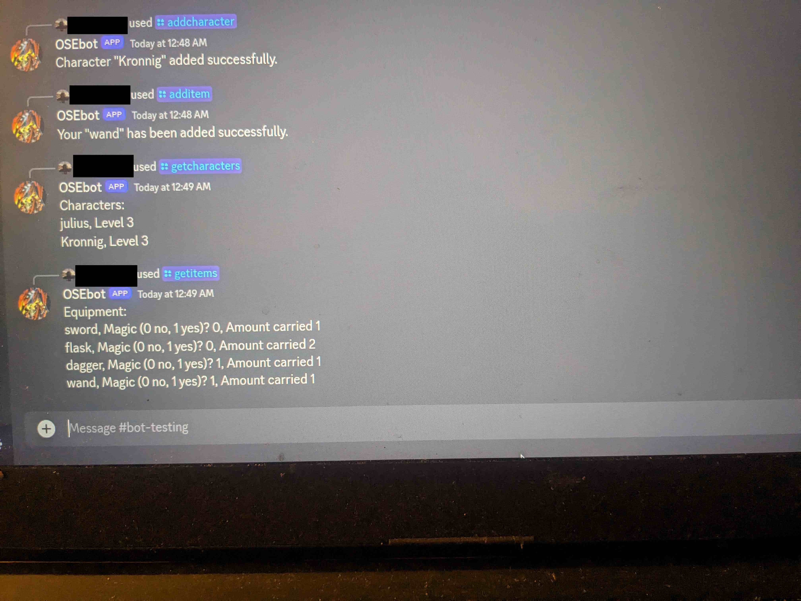

## OSEbot
A discordjs bot used to track gear and PCs for [Old School Essentials](https://necroticgnome.com/).  

#### Tech Stack
This fairly simple bot uses discordjs and psql.  The calls to the database are kept in a database folders and imported into the commands folder where the slash commands are defined.

#### The Idea
I play in an OSE game with people that I had recently met though the mutual desire to play in OSR games and wasn't sure I could make it to all the sessions.  Since I am often the note taker, I wanted to create a bot that I could upload info to and they could access when I wasn't there.  It seemed appropriate to also have a database of the PCs that could be tracked as well.

#### Installing
At this time, I would not recommend installing this app and the bot is not public.  While I was creating this bot I installed uneeded libraries as I was just learning discordjs and wasn't sure if I wanted to use PostgreSQL or something else.
But if you must
```
npm install
```

Create a .env file and use these variables:
```
DISCORD_TOKEN=
CLIENT_ID=
GUILD_ID=
database_name=
database_user=
database_password=
```

The database currently defaults to localhost and the default psql port 5432.  It assumes 2 tables, one called
characters with the columns: player_name, character_name and level.  The other is equipment with the columns: item_name, magic and amount_carried.  Currently, magic is set to bit with 0 meaning false and 1 meaning true, to indicate whether an item is magic or not. 

#### Future Ideas
- make the databases more interactive so you can see what PCs are carrying what items
- add edit slash commands for both the PC and equipment tables
- make the magic true/false in the item table either boolean or yes/no
- take a video or better photos of the bot in action

Photos






